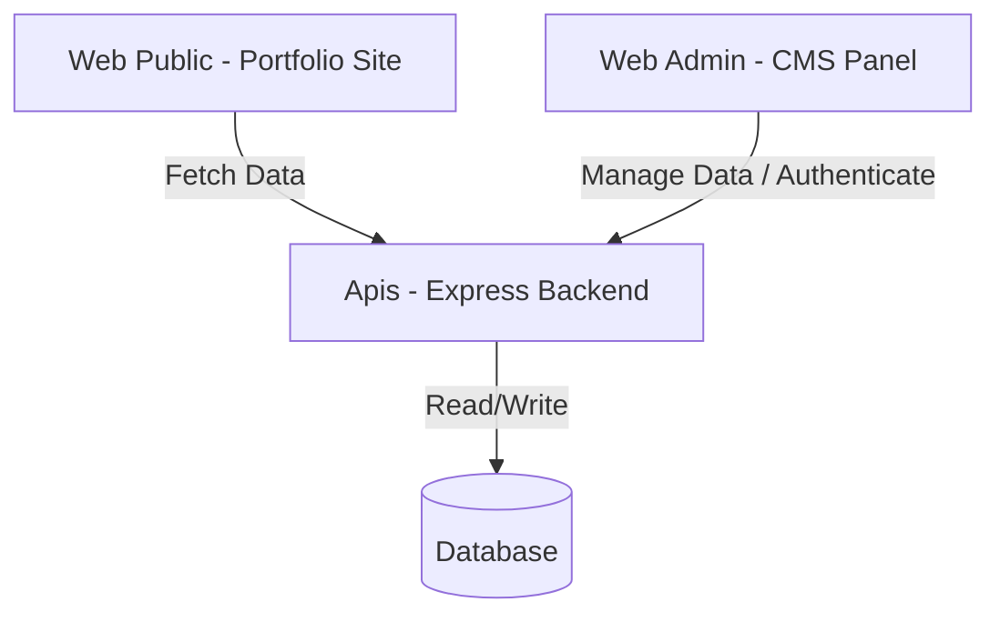

# System Architecture & Specification Rules

This document outlines the general guidelines, architecture, and technology standards for the **Portfolio CMS** project.

## 1. System Architecture

The project is structured as a decoupled multi-app repository located in the [Apps/](file:///Users/hiennguyen/Documents/antigravity/Portfolio%20CMS/Apps) directory:

*   **[Web public](file:///Users/hiennguyen/Documents/antigravity/Portfolio%20CMS/Apps/Web%20public)**: The public-facing site displaying Nguyễn Trà My's portfolio (VEX IQ Robotics, ABRSM Piano, etc.). Fetches data dynamically from the API.
*   **[Web admin](file:///Users/hiennguyen/Documents/antigravity/Portfolio%20CMS/Apps/Web%20admin)**: The CMS dashboard allowing authorized changes to portfolio content.
*   **[Apis](file:///Users/hiennguyen/Documents/antigravity/Portfolio%20CMS/Apps/Apis)**: Node.js Express REST API backend managing authentication, authorization, validation, and data persistence.

---

## 2. Technology Stack & Package Rules

### Technology Stack
1.  **Frontend (Public & Admin)**: React built with **Vite** (via `npx create-vite`).
2.  **Backend**: Node.js with **Express**.
3.  **Database**: **SQLite** (via `sqlite3` or `better-sqlite3`) for self-contained, lightweight local storage.
4.  **Styling**: Vanilla CSS for layouts. Avoid utility frameworks like Tailwind CSS to maintain precise visual control and animation quality.

### Package & Dependency Policy
*   **Active Maintenance**: All imported third-party packages **MUST** be actively maintained and updated within the last 6 months.
*   **Security**: Do not use packages with known vulnerabilities. Check dependencies regularly with `npm audit`.
*   **Lightweight**: Prefer native browser APIs (such as Fetch API, CSS Transitions, Web Animations API) over importing bulky packages.

---

## 3. Database Schema Design

The SQLite database will contain the following tables to model the portfolio data:

### `users`
Stores administrator credentials.
*   `id` (TEXT, PRIMARY KEY) - UUID.
*   `username` (TEXT, UNIQUE, NOT NULL).
*   `password_hash` (TEXT, NOT NULL) - Scrypt or bcrypt hash.
*   `created_at` (DATETIME) - Default current timestamp.

### `profile_info`
Key-value storage for page-wide text settings (About Me bio, contact email, social media links).
*   `key` (TEXT, PRIMARY KEY).
*   `value` (TEXT, NOT NULL).
*   `updated_at` (DATETIME) - Default current timestamp.

### `timeline`
Timeline cards shown under Education & Experience.
*   `id` (TEXT, PRIMARY KEY) - UUID.
*   `type` (TEXT, NOT NULL) - `'education'`, `'certification'`, or `'experience'`.
*   `time_period` (TEXT, NOT NULL) - e.g., `"2024 - Present"`.
*   `title` (TEXT, NOT NULL) - e.g., `"Hành trình Học tập"`.
*   `subtitle` (TEXT) - e.g., `"Trường Quốc tế Tây Úc (WASS)"`.
*   `description` (TEXT) - Bullet points or description markdown.
*   `order_index` (INTEGER, NOT NULL) - Sorting weight.

### `skills`
Skill names and proficiency metrics.
*   `id` (TEXT, PRIMARY KEY) - UUID.
*   `name` (TEXT, NOT NULL) - e.g., `"Biểu diễn Nghệ thuật & Piano"`.
*   `percentage` (INTEGER, NOT NULL) - Value from `0` to `100`.
*   `order_index` (INTEGER, NOT NULL) - Sorting weight.

### `events`
Chronological achievement cards shown under Awards & Activities, and detailed Events listing.
*   `id` (TEXT, PRIMARY KEY) - UUID.
*   `date_string` (TEXT, NOT NULL) - e.g., `"05/2026"`.
*   `category` (TEXT, NOT NULL) - e.g., `"Tournament"`, `"Music Performance"`, `"TV Appearance"`.
*   `title` (TEXT, NOT NULL) - e.g., `"VEX IQ MS World Championship 2026"`.
*   `description` (TEXT, NOT NULL) - Detailed paragraph.
*   `location` (TEXT) - e.g., `"Dallas, Texas, USA"`.
*   `image_url` (TEXT) - Unsplash or local uploaded image URI.
*   `tab_category` (TEXT, NOT NULL) - `'awards'`, `'arts'`, `'science'`, or `'shows'`.
*   `order_index` (INTEGER, NOT NULL) - Sorting weight.

### `gallery`
Embedded videos in the "Behind the Scenes" section.
*   `id` (TEXT, PRIMARY KEY) - UUID.
*   `youtube_id` (TEXT, NOT NULL) - YouTube 11-char video ID.
*   `title` (TEXT, NOT NULL) - e.g., `"Dance Cover ✨"`.
*   `order_index` (INTEGER, NOT NULL) - Sorting weight.

---

## 4. REST API Endpoint Specifications

All administrative API endpoints require a Bearer JWT Token in the request header (`Authorization: Bearer <token>`).

### Public Endpoints
*   `GET /api/portfolio` - Returns a combined payload of `profile_info`, `timeline`, `skills`, `events`, and `gallery` data.

### Auth Endpoints
*   `POST /api/auth/login` - Authenticates user. Returns JWT token.

### Admin CRUD Endpoints
*   `POST /api/auth/setup` - Initial setup (creates first admin if no users exist).
*   `PUT /api/admin/profile` - Updates keys in `profile_info`.
*   `GET/POST/PUT/DELETE /api/admin/timeline` - CRUD for timeline events.
*   `GET/POST/PUT/DELETE /api/admin/skills` - CRUD for skill items.
*   `GET/POST/PUT/DELETE /api/admin/events` - CRUD for awards, activities, and detailed events.
*   `GET/POST/PUT/DELETE /api/admin/gallery` - CRUD for video showcase links.
